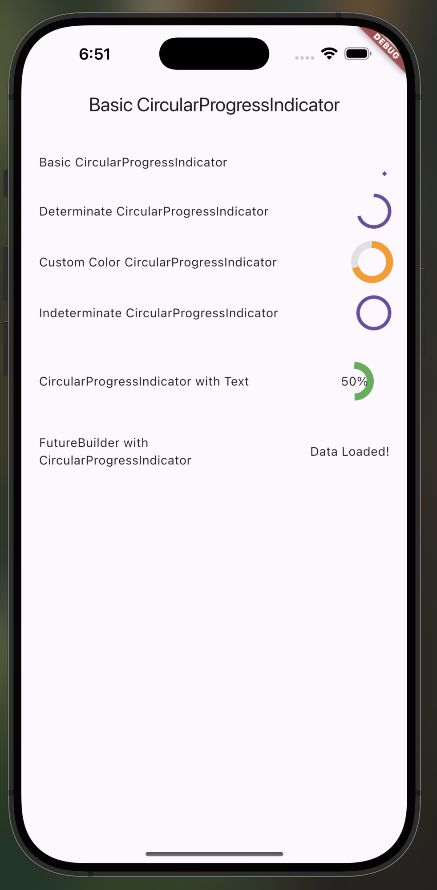

# CircularProgressIndicatorPresentation

A simple Flutter widget that demonstrates different ways to use `CircularProgressIndicator` for showing loading and progress in your app.


## How to Run

1. **Clone the repository:**

   ```bash
   git clone https://github.com/dmutoni/widget_presentation
   cd widget_presentation
   ```
2. **Get dependencies:**

   ```bash
   flutter pub get
   ```
3. **Run the app:**

   ```bash
   flutter run
   ```

## Three Key Attributes Demonstrated

1. **Determinate & Indeterminate Modes:**
   The widget shows both determinate (progress value provided) and indeterminate (spins continuously) progress indicators.

2. **Customization:**
   Demonstrates changing color, size, stroke width, and adding labels inside the progress indicator.

3. **Integration with Async Data:**
   Shows how to display a loading spinner while waiting for a `Future` to complete using `FutureBuilder`.

## Screenshot



## Attribution

This implementation is original, created for class demo purposes. No tutorial code copied.